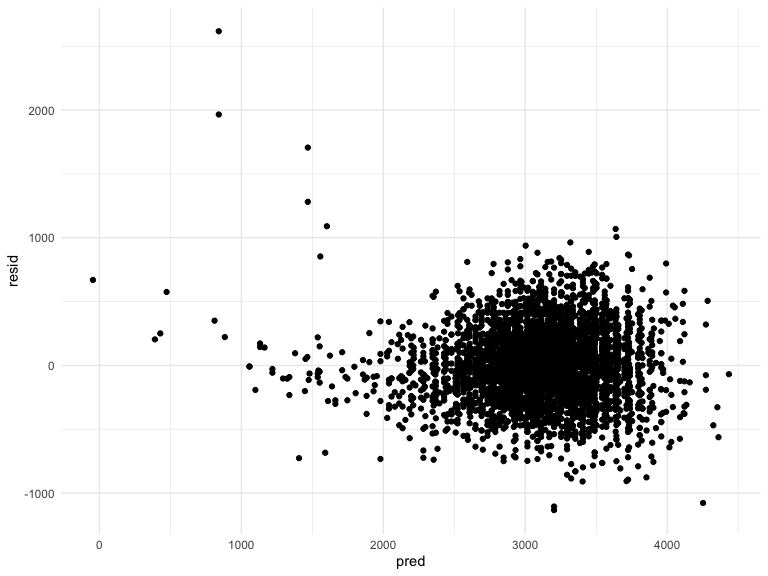
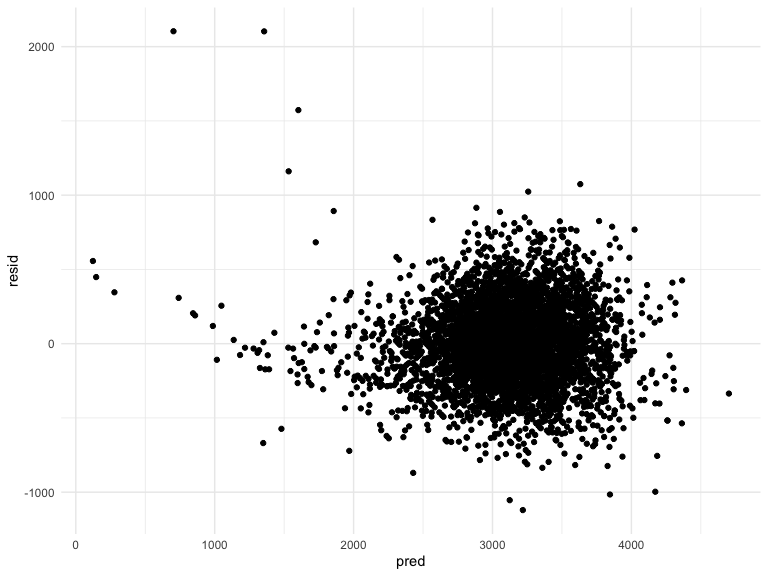
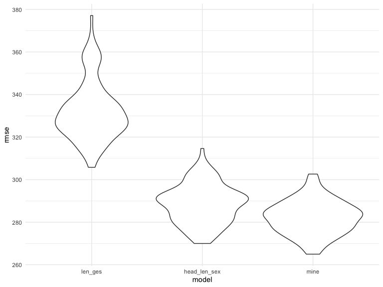
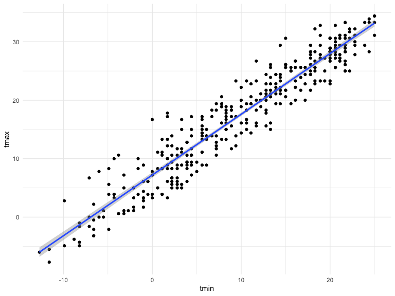
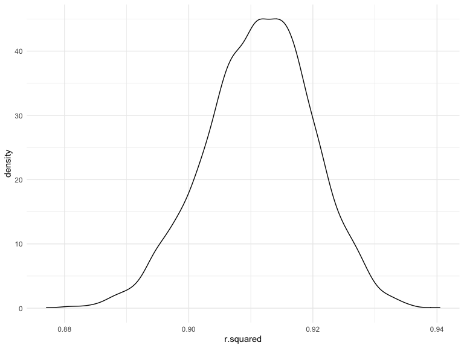
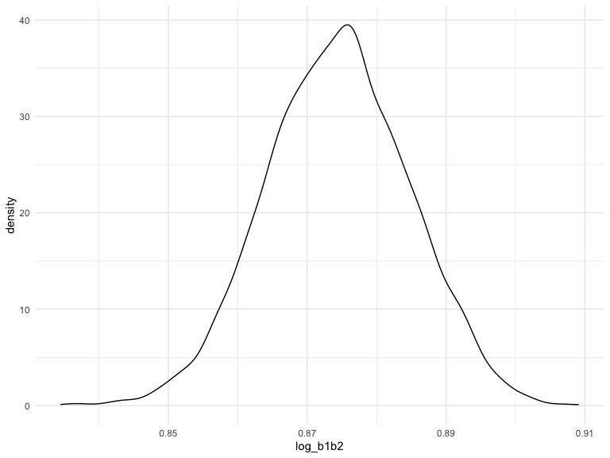

p8105\_hw6\_zh2494
================
zhuolun
11/29/2021

``` r
library(tidyverse)
```

    ## ── Attaching packages ─────────────────────────────────────── tidyverse 1.3.1 ──

    ## ✓ ggplot2 3.3.5     ✓ purrr   0.3.4
    ## ✓ tibble  3.1.4     ✓ dplyr   1.0.7
    ## ✓ tidyr   1.1.3     ✓ stringr 1.4.0
    ## ✓ readr   2.0.1     ✓ forcats 0.5.1

    ## ── Conflicts ────────────────────────────────────────── tidyverse_conflicts() ──
    ## x dplyr::filter() masks stats::filter()
    ## x dplyr::lag()    masks stats::lag()

``` r
library(viridis)
```

    ## Loading required package: viridisLite

``` r
library(modelr)
library(mgcv)
```

    ## Loading required package: nlme

    ## 
    ## Attaching package: 'nlme'

    ## The following object is masked from 'package:dplyr':
    ## 
    ##     collapse

    ## This is mgcv 1.8-36. For overview type 'help("mgcv-package")'.

``` r
library(p8105.datasets)

knitr::opts_chunk$set(
    echo = TRUE,
    warning = FALSE,
    fig.width = 8, 
  fig.height = 6,
  out.width = "90%"
)
options(
  ggplot2.continuous.colour = "viridis",
  ggplot2.continuous.fill = "viridis"
)
scale_colour_discrete = scale_colour_viridis_d
scale_fill_discrete = scale_fill_viridis_d
theme_set(theme_minimal() + theme(legend.position = "bottom"))
set.seed(1)
```

# Problem 1

read and clean the data  
\* The column names are tidy so no need to do anything  
\* Convert units: (pounds to grams, inches to centimeters)

``` r
baby_df = 
  read_csv("data/birthweight.csv") %>% 
  mutate(
    babysex = factor(babysex),
    frace = factor(frace),
    malform = factor(malform),
    mrace = factor(mrace),
    mheight = mheight * 2.54,
    delwt = delwt * 453.592,
    ppwt = ppwt * 453.592,
    wtgain = wtgain * 453.592)
```

    ## Rows: 4342 Columns: 20

    ## ── Column specification ────────────────────────────────────────────────────────
    ## Delimiter: ","
    ## dbl (20): babysex, bhead, blength, bwt, delwt, fincome, frace, gaweeks, malf...

    ## 
    ## ℹ Use `spec()` to retrieve the full column specification for this data.
    ## ℹ Specify the column types or set `show_col_types = FALSE` to quiet this message.

-   checks the number of na, there is 0 missing value.

``` r
sum(is.na(baby_df))
```

    ## [1] 0

Create models

``` r
model_len_ges = lm(bwt ~ blength + gaweeks, data = baby_df)
model_len_ges %>% 
  broom::tidy() %>% 
  knitr::kable(digits = 3)
```

| term        |  estimate | std.error | statistic | p.value |
|:------------|----------:|----------:|----------:|--------:|
| (Intercept) | -4347.667 |    97.958 |   -44.383 |       0 |
| blength     |   128.556 |     1.990 |    64.604 |       0 |
| gaweeks     |    27.047 |     1.718 |    15.744 |       0 |

``` r
model_head_len_sex = lm(bwt ~ bhead * blength * babysex, data = baby_df)
model_head_len_sex %>% 
  broom::tidy() %>% 
  knitr::kable(digits = 3)
```

| term                   |  estimate | std.error | statistic | p.value |
|:-----------------------|----------:|----------:|----------:|--------:|
| (Intercept)            | -7176.817 |  1264.840 |    -5.674 |   0.000 |
| bhead                  |   181.796 |    38.054 |     4.777 |   0.000 |
| blength                |   102.127 |    26.212 |     3.896 |   0.000 |
| babysex2               |  6374.868 |  1677.767 |     3.800 |   0.000 |
| bhead:blength          |    -0.554 |     0.780 |    -0.710 |   0.478 |
| bhead:babysex2         |  -198.393 |    51.092 |    -3.883 |   0.000 |
| blength:babysex2       |  -123.773 |    35.119 |    -3.524 |   0.000 |
| bhead:blength:babysex2 |     3.878 |     1.057 |     3.670 |   0.000 |

The p-value = 0 becasue it is smaller than the minimum display value.
Also notice that `bhead:blength` is not significant.

the plot of model residuals against fitted values for the first model:
length at birth and gestational age as predictors

``` r
baby_df %>% 
  modelr::add_residuals(model_len_ges) %>% 
  modelr::add_predictions(model_len_ges) %>% 
  ggplot(aes(x = pred, y = resid)) + 
  geom_point()
```


comment: there are some wired values, but overall is good

a plot of model residuals against fitted values for the second model:
head circumference, length at birth, sex, and all interactions
(including the three-way interaction).

``` r
baby_df %>% 
  modelr::add_residuals(model_head_len_sex) %>% 
  modelr::add_predictions(model_head_len_sex) %>% 
  ggplot(aes(x = pred, y = resid)) + 
  geom_point()
```


comment: there are some wired values, but overall is good

Both required models are good. Now consider my own models.

``` r
mymodel =
  lm(bwt ~ (bhead + blength + delwt + mheight + pnumlbw + ppbmi + ppwt + smoken + wtgain)^2, data = baby_df)

baby_df %>% 
  modelr::add_residuals(mymodel) %>% 
  modelr::add_predictions(mymodel) %>% 
  ggplot(aes(x = pred, y = resid)) +
  geom_point()
```


``` r
mod_select = step(mymodel, direction = 'backward')
```

    ## Start:  AIC=49005.33
    ## bwt ~ (bhead + blength + delwt + mheight + pnumlbw + ppbmi + 
    ##     ppwt + smoken + wtgain)^2
    ## 
    ## 
    ## Step:  AIC=49005.33
    ## bwt ~ bhead + blength + delwt + mheight + pnumlbw + ppbmi + ppwt + 
    ##     smoken + wtgain + bhead:blength + bhead:delwt + bhead:mheight + 
    ##     bhead:pnumlbw + bhead:ppbmi + bhead:ppwt + bhead:smoken + 
    ##     bhead:wtgain + blength:delwt + blength:mheight + blength:pnumlbw + 
    ##     blength:ppbmi + blength:ppwt + blength:smoken + blength:wtgain + 
    ##     delwt:mheight + delwt:pnumlbw + delwt:ppbmi + delwt:ppwt + 
    ##     delwt:smoken + delwt:wtgain + mheight:pnumlbw + mheight:ppbmi + 
    ##     mheight:ppwt + mheight:smoken + mheight:wtgain + pnumlbw:ppbmi + 
    ##     pnumlbw:ppwt + pnumlbw:smoken + pnumlbw:wtgain + ppbmi:ppwt + 
    ##     ppbmi:smoken + ppbmi:wtgain + ppwt:smoken + ppwt:wtgain
    ## 
    ## 
    ## Step:  AIC=49005.33
    ## bwt ~ bhead + blength + delwt + mheight + pnumlbw + ppbmi + ppwt + 
    ##     smoken + wtgain + bhead:blength + bhead:delwt + bhead:mheight + 
    ##     bhead:pnumlbw + bhead:ppbmi + bhead:ppwt + bhead:smoken + 
    ##     bhead:wtgain + blength:delwt + blength:mheight + blength:pnumlbw + 
    ##     blength:ppbmi + blength:ppwt + blength:smoken + blength:wtgain + 
    ##     delwt:mheight + delwt:pnumlbw + delwt:ppbmi + delwt:ppwt + 
    ##     delwt:smoken + delwt:wtgain + mheight:pnumlbw + mheight:ppbmi + 
    ##     mheight:ppwt + mheight:smoken + mheight:wtgain + pnumlbw:ppbmi + 
    ##     pnumlbw:ppwt + pnumlbw:smoken + pnumlbw:wtgain + ppbmi:ppwt + 
    ##     ppbmi:smoken + ppwt:smoken + ppwt:wtgain
    ## 
    ## 
    ## Step:  AIC=49005.33
    ## bwt ~ bhead + blength + delwt + mheight + pnumlbw + ppbmi + ppwt + 
    ##     smoken + wtgain + bhead:blength + bhead:delwt + bhead:mheight + 
    ##     bhead:pnumlbw + bhead:ppbmi + bhead:ppwt + bhead:smoken + 
    ##     bhead:wtgain + blength:delwt + blength:mheight + blength:pnumlbw + 
    ##     blength:ppbmi + blength:ppwt + blength:smoken + blength:wtgain + 
    ##     delwt:mheight + delwt:pnumlbw + delwt:ppbmi + delwt:ppwt + 
    ##     delwt:smoken + delwt:wtgain + mheight:pnumlbw + mheight:ppbmi + 
    ##     mheight:ppwt + mheight:smoken + mheight:wtgain + pnumlbw:ppbmi + 
    ##     pnumlbw:ppwt + pnumlbw:smoken + ppbmi:ppwt + ppbmi:smoken + 
    ##     ppwt:smoken + ppwt:wtgain
    ## 
    ## 
    ## Step:  AIC=49005.33
    ## bwt ~ bhead + blength + delwt + mheight + pnumlbw + ppbmi + ppwt + 
    ##     smoken + wtgain + bhead:blength + bhead:delwt + bhead:mheight + 
    ##     bhead:pnumlbw + bhead:ppbmi + bhead:ppwt + bhead:smoken + 
    ##     bhead:wtgain + blength:delwt + blength:mheight + blength:pnumlbw + 
    ##     blength:ppbmi + blength:ppwt + blength:smoken + blength:wtgain + 
    ##     delwt:mheight + delwt:pnumlbw + delwt:ppbmi + delwt:ppwt + 
    ##     delwt:smoken + delwt:wtgain + mheight:pnumlbw + mheight:ppbmi + 
    ##     mheight:ppwt + mheight:smoken + mheight:wtgain + pnumlbw:ppbmi + 
    ##     pnumlbw:ppwt + ppbmi:ppwt + ppbmi:smoken + ppwt:smoken + 
    ##     ppwt:wtgain
    ## 
    ## 
    ## Step:  AIC=49005.33
    ## bwt ~ bhead + blength + delwt + mheight + pnumlbw + ppbmi + ppwt + 
    ##     smoken + wtgain + bhead:blength + bhead:delwt + bhead:mheight + 
    ##     bhead:pnumlbw + bhead:ppbmi + bhead:ppwt + bhead:smoken + 
    ##     bhead:wtgain + blength:delwt + blength:mheight + blength:pnumlbw + 
    ##     blength:ppbmi + blength:ppwt + blength:smoken + blength:wtgain + 
    ##     delwt:mheight + delwt:pnumlbw + delwt:ppbmi + delwt:ppwt + 
    ##     delwt:smoken + delwt:wtgain + mheight:pnumlbw + mheight:ppbmi + 
    ##     mheight:ppwt + mheight:smoken + mheight:wtgain + pnumlbw:ppbmi + 
    ##     ppbmi:ppwt + ppbmi:smoken + ppwt:smoken + ppwt:wtgain
    ## 
    ## 
    ## Step:  AIC=49005.33
    ## bwt ~ bhead + blength + delwt + mheight + pnumlbw + ppbmi + ppwt + 
    ##     smoken + wtgain + bhead:blength + bhead:delwt + bhead:mheight + 
    ##     bhead:pnumlbw + bhead:ppbmi + bhead:ppwt + bhead:smoken + 
    ##     bhead:wtgain + blength:delwt + blength:mheight + blength:pnumlbw + 
    ##     blength:ppbmi + blength:ppwt + blength:smoken + blength:wtgain + 
    ##     delwt:mheight + delwt:pnumlbw + delwt:ppbmi + delwt:ppwt + 
    ##     delwt:smoken + delwt:wtgain + mheight:pnumlbw + mheight:ppbmi + 
    ##     mheight:ppwt + mheight:smoken + mheight:wtgain + ppbmi:ppwt + 
    ##     ppbmi:smoken + ppwt:smoken + ppwt:wtgain
    ## 
    ## 
    ## Step:  AIC=49005.33
    ## bwt ~ bhead + blength + delwt + mheight + pnumlbw + ppbmi + ppwt + 
    ##     smoken + wtgain + bhead:blength + bhead:delwt + bhead:mheight + 
    ##     bhead:pnumlbw + bhead:ppbmi + bhead:ppwt + bhead:smoken + 
    ##     bhead:wtgain + blength:delwt + blength:mheight + blength:pnumlbw + 
    ##     blength:ppbmi + blength:ppwt + blength:smoken + blength:wtgain + 
    ##     delwt:mheight + delwt:pnumlbw + delwt:ppbmi + delwt:ppwt + 
    ##     delwt:smoken + delwt:wtgain + mheight:pnumlbw + mheight:ppbmi + 
    ##     mheight:ppwt + mheight:smoken + ppbmi:ppwt + ppbmi:smoken + 
    ##     ppwt:smoken + ppwt:wtgain
    ## 
    ## 
    ## Step:  AIC=49005.33
    ## bwt ~ bhead + blength + delwt + mheight + pnumlbw + ppbmi + ppwt + 
    ##     smoken + wtgain + bhead:blength + bhead:delwt + bhead:mheight + 
    ##     bhead:pnumlbw + bhead:ppbmi + bhead:ppwt + bhead:smoken + 
    ##     bhead:wtgain + blength:delwt + blength:mheight + blength:pnumlbw + 
    ##     blength:ppbmi + blength:ppwt + blength:smoken + blength:wtgain + 
    ##     delwt:mheight + delwt:pnumlbw + delwt:ppbmi + delwt:ppwt + 
    ##     delwt:smoken + delwt:wtgain + mheight:ppbmi + mheight:ppwt + 
    ##     mheight:smoken + ppbmi:ppwt + ppbmi:smoken + ppwt:smoken + 
    ##     ppwt:wtgain
    ## 
    ## 
    ## Step:  AIC=49005.33
    ## bwt ~ bhead + blength + delwt + mheight + pnumlbw + ppbmi + ppwt + 
    ##     smoken + wtgain + bhead:blength + bhead:delwt + bhead:mheight + 
    ##     bhead:pnumlbw + bhead:ppbmi + bhead:ppwt + bhead:smoken + 
    ##     bhead:wtgain + blength:delwt + blength:mheight + blength:pnumlbw + 
    ##     blength:ppbmi + blength:ppwt + blength:smoken + blength:wtgain + 
    ##     delwt:mheight + delwt:ppbmi + delwt:ppwt + delwt:smoken + 
    ##     delwt:wtgain + mheight:ppbmi + mheight:ppwt + mheight:smoken + 
    ##     ppbmi:ppwt + ppbmi:smoken + ppwt:smoken + ppwt:wtgain
    ## 
    ## 
    ## Step:  AIC=49005.33
    ## bwt ~ bhead + blength + delwt + mheight + pnumlbw + ppbmi + ppwt + 
    ##     smoken + wtgain + bhead:blength + bhead:delwt + bhead:mheight + 
    ##     bhead:pnumlbw + bhead:ppbmi + bhead:ppwt + bhead:smoken + 
    ##     bhead:wtgain + blength:delwt + blength:mheight + blength:pnumlbw + 
    ##     blength:ppbmi + blength:ppwt + blength:smoken + delwt:mheight + 
    ##     delwt:ppbmi + delwt:ppwt + delwt:smoken + delwt:wtgain + 
    ##     mheight:ppbmi + mheight:ppwt + mheight:smoken + ppbmi:ppwt + 
    ##     ppbmi:smoken + ppwt:smoken + ppwt:wtgain
    ## 
    ## 
    ## Step:  AIC=49005.33
    ## bwt ~ bhead + blength + delwt + mheight + pnumlbw + ppbmi + ppwt + 
    ##     smoken + wtgain + bhead:blength + bhead:delwt + bhead:mheight + 
    ##     bhead:pnumlbw + bhead:ppbmi + bhead:ppwt + bhead:smoken + 
    ##     bhead:wtgain + blength:delwt + blength:mheight + blength:ppbmi + 
    ##     blength:ppwt + blength:smoken + delwt:mheight + delwt:ppbmi + 
    ##     delwt:ppwt + delwt:smoken + delwt:wtgain + mheight:ppbmi + 
    ##     mheight:ppwt + mheight:smoken + ppbmi:ppwt + ppbmi:smoken + 
    ##     ppwt:smoken + ppwt:wtgain
    ## 
    ## 
    ## Step:  AIC=49005.33
    ## bwt ~ bhead + blength + delwt + mheight + pnumlbw + ppbmi + ppwt + 
    ##     smoken + wtgain + bhead:blength + bhead:delwt + bhead:mheight + 
    ##     bhead:pnumlbw + bhead:ppbmi + bhead:ppwt + bhead:smoken + 
    ##     blength:delwt + blength:mheight + blength:ppbmi + blength:ppwt + 
    ##     blength:smoken + delwt:mheight + delwt:ppbmi + delwt:ppwt + 
    ##     delwt:smoken + delwt:wtgain + mheight:ppbmi + mheight:ppwt + 
    ##     mheight:smoken + ppbmi:ppwt + ppbmi:smoken + ppwt:smoken + 
    ##     ppwt:wtgain
    ## 
    ## 
    ## Step:  AIC=49005.33
    ## bwt ~ bhead + blength + delwt + mheight + pnumlbw + ppbmi + ppwt + 
    ##     smoken + wtgain + bhead:blength + bhead:delwt + bhead:mheight + 
    ##     bhead:ppbmi + bhead:ppwt + bhead:smoken + blength:delwt + 
    ##     blength:mheight + blength:ppbmi + blength:ppwt + blength:smoken + 
    ##     delwt:mheight + delwt:ppbmi + delwt:ppwt + delwt:smoken + 
    ##     delwt:wtgain + mheight:ppbmi + mheight:ppwt + mheight:smoken + 
    ##     ppbmi:ppwt + ppbmi:smoken + ppwt:smoken + ppwt:wtgain
    ## 
    ## 
    ## Step:  AIC=49005.33
    ## bwt ~ bhead + blength + delwt + mheight + ppbmi + ppwt + smoken + 
    ##     wtgain + bhead:blength + bhead:delwt + bhead:mheight + bhead:ppbmi + 
    ##     bhead:ppwt + bhead:smoken + blength:delwt + blength:mheight + 
    ##     blength:ppbmi + blength:ppwt + blength:smoken + delwt:mheight + 
    ##     delwt:ppbmi + delwt:ppwt + delwt:smoken + delwt:wtgain + 
    ##     mheight:ppbmi + mheight:ppwt + mheight:smoken + ppbmi:ppwt + 
    ##     ppbmi:smoken + ppwt:smoken + ppwt:wtgain
    ## 
    ##                   Df Sum of Sq       RSS   AIC
    ## - delwt:mheight    1       169 341262374 49003
    ## - delwt:ppwt       1       373 341262577 49003
    ## - ppbmi:ppwt       1      2397 341264602 49003
    ## - bhead:blength    1      2724 341264929 49003
    ## - delwt:ppbmi      1      4619 341266823 49003
    ## - bhead:ppwt       1      9221 341271426 49003
    ## - ppwt:wtgain      1     11239 341273444 49003
    ## - blength:ppwt     1     38319 341300524 49004
    ## - ppbmi:smoken     1     38366 341300571 49004
    ## - bhead:ppbmi      1     38595 341300799 49004
    ## - mheight:smoken   1     55575 341317780 49004
    ## - ppwt:smoken      1     57603 341319807 49004
    ## - delwt:smoken     1     59455 341321660 49004
    ## - bhead:delwt      1    121196 341383400 49005
    ## - bhead:mheight    1    135447 341397651 49005
    ## <none>                         341262204 49005
    ## - blength:ppbmi    1    168707 341430912 49005
    ## - blength:mheight  1    173586 341435790 49006
    ## - bhead:smoken     1    199475 341461679 49006
    ## - mheight:ppwt     1    307318 341569522 49007
    ## - mheight:ppbmi    1    408457 341670661 49009
    ## - blength:smoken   1    705654 341967859 49012
    ## - delwt:wtgain     1    878492 342140697 49014
    ## - blength:delwt    1   1203184 342465388 49019
    ## 
    ## Step:  AIC=49003.34
    ## bwt ~ bhead + blength + delwt + mheight + ppbmi + ppwt + smoken + 
    ##     wtgain + bhead:blength + bhead:delwt + bhead:mheight + bhead:ppbmi + 
    ##     bhead:ppwt + bhead:smoken + blength:delwt + blength:mheight + 
    ##     blength:ppbmi + blength:ppwt + blength:smoken + delwt:ppbmi + 
    ##     delwt:ppwt + delwt:smoken + delwt:wtgain + mheight:ppbmi + 
    ##     mheight:ppwt + mheight:smoken + ppbmi:ppwt + ppbmi:smoken + 
    ##     ppwt:smoken + ppwt:wtgain
    ## 
    ##                   Df Sum of Sq       RSS   AIC
    ## - delwt:ppwt       1       275 341262649 49001
    ## - bhead:blength    1      2723 341265097 49001
    ## - bhead:ppwt       1      9109 341271483 49001
    ## - ppbmi:ppwt       1     11552 341273926 49001
    ## - ppbmi:smoken     1     38370 341300744 49002
    ## - bhead:ppbmi      1     38428 341300802 49002
    ## - blength:ppwt     1     40168 341302542 49002
    ## - mheight:smoken   1     55686 341318060 49002
    ## - ppwt:smoken      1     57773 341320147 49002
    ## - delwt:smoken     1     59408 341321782 49002
    ## - ppwt:wtgain      1     72920 341335294 49002
    ## - delwt:ppbmi      1     84166 341346540 49002
    ## - bhead:delwt      1    121029 341383402 49003
    ## - bhead:mheight    1    135423 341397797 49003
    ## <none>                         341262374 49003
    ## - blength:ppbmi    1    174759 341437133 49004
    ## - blength:mheight  1    179752 341442126 49004
    ## - bhead:smoken     1    199807 341462181 49004
    ## - mheight:ppbmi    1    408584 341670957 49007
    ## - mheight:ppwt     1    432505 341694879 49007
    ## - blength:smoken   1    705901 341968274 49010
    ## - delwt:wtgain     1    878566 342140940 49012
    ## - blength:delwt    1   1203202 342465576 49017
    ## 
    ## Step:  AIC=49001.34
    ## bwt ~ bhead + blength + delwt + mheight + ppbmi + ppwt + smoken + 
    ##     wtgain + bhead:blength + bhead:delwt + bhead:mheight + bhead:ppbmi + 
    ##     bhead:ppwt + bhead:smoken + blength:delwt + blength:mheight + 
    ##     blength:ppbmi + blength:ppwt + blength:smoken + delwt:ppbmi + 
    ##     delwt:smoken + delwt:wtgain + mheight:ppbmi + mheight:ppwt + 
    ##     mheight:smoken + ppbmi:ppwt + ppbmi:smoken + ppwt:smoken + 
    ##     ppwt:wtgain
    ## 
    ##                   Df Sum of Sq       RSS   AIC
    ## - bhead:blength    1      2730 341265379 48999
    ## - bhead:ppwt       1      9380 341272029 48999
    ## - ppbmi:smoken     1     38315 341300964 49000
    ## - bhead:ppbmi      1     38937 341301586 49000
    ## - blength:ppwt     1     40319 341302967 49000
    ## - ppbmi:ppwt       1     44573 341307222 49000
    ## - mheight:smoken   1     55725 341318374 49000
    ## - ppwt:smoken      1     57769 341320418 49000
    ## - delwt:smoken     1     59470 341322119 49000
    ## - delwt:ppbmi      1     83913 341346562 49000
    ## - bhead:delwt      1    120782 341383431 49001
    ## - bhead:mheight    1    136419 341399068 49001
    ## <none>                         341262649 49001
    ## - blength:ppbmi    1    175190 341437839 49002
    ## - blength:mheight  1    180279 341442928 49002
    ## - bhead:smoken     1    199558 341462207 49002
    ## - ppwt:wtgain      1    229101 341491749 49002
    ## - mheight:ppbmi    1    413363 341676012 49005
    ## - mheight:ppwt     1    435504 341698153 49005
    ## - blength:smoken   1    705630 341968279 49008
    ## - delwt:wtgain     1    882837 342145485 49011
    ## - blength:delwt    1   1203782 342466431 49015
    ## 
    ## Step:  AIC=48999.37
    ## bwt ~ bhead + blength + delwt + mheight + ppbmi + ppwt + smoken + 
    ##     wtgain + bhead:delwt + bhead:mheight + bhead:ppbmi + bhead:ppwt + 
    ##     bhead:smoken + blength:delwt + blength:mheight + blength:ppbmi + 
    ##     blength:ppwt + blength:smoken + delwt:ppbmi + delwt:smoken + 
    ##     delwt:wtgain + mheight:ppbmi + mheight:ppwt + mheight:smoken + 
    ##     ppbmi:ppwt + ppbmi:smoken + ppwt:smoken + ppwt:wtgain
    ## 
    ##                   Df Sum of Sq       RSS   AIC
    ## - bhead:ppwt       1     10024 341275403 48998
    ## - ppbmi:smoken     1     38273 341303651 48998
    ## - bhead:ppbmi      1     39369 341304748 48998
    ## - blength:ppwt     1     39788 341305166 48998
    ## - ppbmi:ppwt       1     43359 341308738 48998
    ## - mheight:smoken   1     55760 341321138 48998
    ## - ppwt:smoken      1     57902 341323281 48998
    ## - delwt:smoken     1     60880 341326258 48998
    ## - delwt:ppbmi      1     82452 341347830 48998
    ## - bhead:delwt      1    121271 341386649 48999
    ## - bhead:mheight    1    137616 341402994 48999
    ## <none>                         341265379 48999
    ## - blength:ppbmi    1    174609 341439987 49000
    ## - blength:mheight  1    179438 341444816 49000
    ## - bhead:smoken     1    198583 341463962 49000
    ## - ppwt:wtgain      1    227443 341492821 49000
    ## - mheight:ppbmi    1    413490 341678869 49003
    ## - mheight:ppwt     1    435804 341701182 49003
    ## - blength:smoken   1    703052 341968430 49006
    ## - delwt:wtgain     1    900026 342165405 49009
    ## - blength:delwt    1   1245815 342511193 49013
    ## 
    ## Step:  AIC=48997.5
    ## bwt ~ bhead + blength + delwt + mheight + ppbmi + ppwt + smoken + 
    ##     wtgain + bhead:delwt + bhead:mheight + bhead:ppbmi + bhead:smoken + 
    ##     blength:delwt + blength:mheight + blength:ppbmi + blength:ppwt + 
    ##     blength:smoken + delwt:ppbmi + delwt:smoken + delwt:wtgain + 
    ##     mheight:ppbmi + mheight:ppwt + mheight:smoken + ppbmi:ppwt + 
    ##     ppbmi:smoken + ppwt:smoken + ppwt:wtgain
    ## 
    ##                   Df Sum of Sq       RSS   AIC
    ## - blength:ppwt     1     31187 341306590 48996
    ## - ppbmi:smoken     1     37625 341313028 48996
    ## - ppbmi:ppwt       1     43860 341319263 48996
    ## - mheight:smoken   1     54718 341330121 48996
    ## - ppwt:smoken      1     57459 341332862 48996
    ## - delwt:smoken     1     62894 341338297 48996
    ## - delwt:ppbmi      1     83377 341358780 48997
    ## - bhead:delwt      1    129834 341405237 48997
    ## <none>                         341275403 48998
    ## - bhead:smoken     1    203056 341478460 48998
    ## - blength:ppbmi    1    208526 341483929 48998
    ## - blength:mheight  1    215236 341490640 48998
    ## - ppwt:wtgain      1    227514 341502917 48998
    ## - bhead:ppbmi      1    388182 341663585 49000
    ## - mheight:ppbmi    1    414288 341689691 49001
    ## - mheight:ppwt     1    435666 341711069 49001
    ## - blength:smoken   1    710021 341985424 49005
    ## - delwt:wtgain     1    904707 342180110 49007
    ## - blength:delwt    1   1264058 342539461 49012
    ## - bhead:mheight    1   1682354 342957757 49017
    ## 
    ## Step:  AIC=48995.9
    ## bwt ~ bhead + blength + delwt + mheight + ppbmi + ppwt + smoken + 
    ##     wtgain + bhead:delwt + bhead:mheight + bhead:ppbmi + bhead:smoken + 
    ##     blength:delwt + blength:mheight + blength:ppbmi + blength:smoken + 
    ##     delwt:ppbmi + delwt:smoken + delwt:wtgain + mheight:ppbmi + 
    ##     mheight:ppwt + mheight:smoken + ppbmi:ppwt + ppbmi:smoken + 
    ##     ppwt:smoken + ppwt:wtgain
    ## 
    ##                   Df Sum of Sq       RSS   AIC
    ## - ppbmi:smoken     1     36945 341343536 48994
    ## - ppbmi:ppwt       1     49831 341356421 48995
    ## - mheight:smoken   1     53765 341360355 48995
    ## - ppwt:smoken      1     56650 341363240 48995
    ## - delwt:smoken     1     64645 341371235 48995
    ## - delwt:ppbmi      1     91775 341398365 48995
    ## - bhead:delwt      1    127981 341434571 48996
    ## <none>                         341306590 48996
    ## - bhead:smoken     1    205492 341512083 48997
    ## - ppwt:wtgain      1    244364 341550954 48997
    ## - bhead:ppbmi      1    382345 341688935 48999
    ## - mheight:ppbmi    1    413471 341720061 48999
    ## - mheight:ppwt     1    434810 341741401 48999
    ## - blength:smoken   1    705691 342012281 49003
    ## - delwt:wtgain     1    906667 342213257 49005
    ## - blength:mheight  1   1107357 342413947 49008
    ## - blength:delwt    1   1294523 342601113 49010
    ## - bhead:mheight    1   1675240 342981830 49015
    ## - blength:ppbmi    1   1866839 343173429 49018
    ## 
    ## Step:  AIC=48994.37
    ## bwt ~ bhead + blength + delwt + mheight + ppbmi + ppwt + smoken + 
    ##     wtgain + bhead:delwt + bhead:mheight + bhead:ppbmi + bhead:smoken + 
    ##     blength:delwt + blength:mheight + blength:ppbmi + blength:smoken + 
    ##     delwt:ppbmi + delwt:smoken + delwt:wtgain + mheight:ppbmi + 
    ##     mheight:ppwt + mheight:smoken + ppbmi:ppwt + ppwt:smoken + 
    ##     ppwt:wtgain
    ## 
    ##                   Df Sum of Sq       RSS   AIC
    ## - ppbmi:ppwt       1     44243 341387778 48993
    ## - mheight:smoken   1     55002 341398538 48993
    ## - delwt:smoken     1     69198 341412734 48993
    ## - delwt:ppbmi      1     82784 341426320 48993
    ## - ppwt:smoken      1     86836 341430372 48993
    ## - bhead:delwt      1    122926 341466462 48994
    ## <none>                         341343536 48994
    ## - bhead:smoken     1    197029 341540565 48995
    ## - ppwt:wtgain      1    233485 341577021 48995
    ## - bhead:ppbmi      1    371884 341715419 48997
    ## - mheight:ppbmi    1    385276 341728812 48997
    ## - mheight:ppwt     1    407057 341750592 48998
    ## - blength:smoken   1    688665 342032201 49001
    ## - delwt:wtgain     1    902673 342246209 49004
    ## - blength:mheight  1   1090900 342434435 49006
    ## - blength:delwt    1   1282915 342626450 49009
    ## - bhead:mheight    1   1654778 342998314 49013
    ## - blength:ppbmi    1   1859807 343203343 49016
    ## 
    ## Step:  AIC=48992.93
    ## bwt ~ bhead + blength + delwt + mheight + ppbmi + ppwt + smoken + 
    ##     wtgain + bhead:delwt + bhead:mheight + bhead:ppbmi + bhead:smoken + 
    ##     blength:delwt + blength:mheight + blength:ppbmi + blength:smoken + 
    ##     delwt:ppbmi + delwt:smoken + delwt:wtgain + mheight:ppbmi + 
    ##     mheight:ppwt + mheight:smoken + ppwt:smoken + ppwt:wtgain
    ## 
    ##                   Df Sum of Sq       RSS   AIC
    ## - mheight:smoken   1     61635 341449414 48992
    ## - delwt:smoken     1     74319 341462097 48992
    ## - ppwt:smoken      1     94753 341482531 48992
    ## - bhead:delwt      1    118977 341506755 48992
    ## <none>                         341387778 48993
    ## - bhead:smoken     1    197890 341585669 48993
    ## - delwt:ppbmi      1    274720 341662498 48994
    ## - bhead:ppbmi      1    371059 341758837 48996
    ## - ppwt:wtgain      1    382242 341770020 48996
    ## - mheight:ppbmi    1    390582 341778360 48996
    ## - mheight:ppwt     1    413093 341800872 48996
    ## - blength:smoken   1    691101 342078879 49000
    ## - delwt:wtgain     1    861339 342249117 49002
    ## - blength:mheight  1   1076739 342464517 49005
    ## - blength:delwt    1   1313508 342701286 49008
    ## - bhead:mheight    1   1673029 343060808 49012
    ## - blength:ppbmi    1   1910797 343298575 49015
    ## 
    ## Step:  AIC=48991.71
    ## bwt ~ bhead + blength + delwt + mheight + ppbmi + ppwt + smoken + 
    ##     wtgain + bhead:delwt + bhead:mheight + bhead:ppbmi + bhead:smoken + 
    ##     blength:delwt + blength:mheight + blength:ppbmi + blength:smoken + 
    ##     delwt:ppbmi + delwt:smoken + delwt:wtgain + mheight:ppbmi + 
    ##     mheight:ppwt + ppwt:smoken + ppwt:wtgain
    ## 
    ##                   Df Sum of Sq       RSS   AIC
    ## - ppwt:smoken      1     66563 341515977 48991
    ## - delwt:smoken     1     73705 341523119 48991
    ## - bhead:delwt      1    116588 341566002 48991
    ## <none>                         341449414 48992
    ## - bhead:smoken     1    204580 341653994 48992
    ## - delwt:ppbmi      1    288076 341737489 48993
    ## - bhead:ppbmi      1    368453 341817867 48994
    ## - ppwt:wtgain      1    378694 341828107 48995
    ## - mheight:ppbmi    1    384420 341833833 48995
    ## - mheight:ppwt     1    403331 341852745 48995
    ## - blength:smoken   1    749259 342198673 48999
    ## - delwt:wtgain     1    857791 342307205 49001
    ## - blength:mheight  1   1092639 342542052 49004
    ## - blength:delwt    1   1316774 342766188 49006
    ## - bhead:mheight    1   1652117 343101531 49011
    ## - blength:ppbmi    1   1897951 343347365 49014
    ## 
    ## Step:  AIC=48990.56
    ## bwt ~ bhead + blength + delwt + mheight + ppbmi + ppwt + smoken + 
    ##     wtgain + bhead:delwt + bhead:mheight + bhead:ppbmi + bhead:smoken + 
    ##     blength:delwt + blength:mheight + blength:ppbmi + blength:smoken + 
    ##     delwt:ppbmi + delwt:smoken + delwt:wtgain + mheight:ppbmi + 
    ##     mheight:ppwt + ppwt:wtgain
    ## 
    ##                   Df Sum of Sq       RSS   AIC
    ## - delwt:smoken     1      9258 341525235 48989
    ## - bhead:delwt      1    117335 341633312 48990
    ## <none>                         341515977 48991
    ## - bhead:smoken     1    188239 341704215 48991
    ## - delwt:ppbmi      1    288468 341804445 48992
    ## - bhead:ppbmi      1    367149 341883126 48993
    ## - ppwt:wtgain      1    376961 341892938 48993
    ## - mheight:ppbmi    1    382442 341898419 48993
    ## - mheight:ppwt     1    401780 341917757 48994
    ## - blength:smoken   1    754395 342270372 48998
    ## - delwt:wtgain     1    837374 342353351 48999
    ## - blength:mheight  1   1061342 342577319 49002
    ## - blength:delwt    1   1282759 342798736 49005
    ## - bhead:mheight    1   1655288 343171265 49010
    ## - blength:ppbmi    1   1851291 343367268 49012
    ## 
    ## Step:  AIC=48988.68
    ## bwt ~ bhead + blength + delwt + mheight + ppbmi + ppwt + smoken + 
    ##     wtgain + bhead:delwt + bhead:mheight + bhead:ppbmi + bhead:smoken + 
    ##     blength:delwt + blength:mheight + blength:ppbmi + blength:smoken + 
    ##     delwt:ppbmi + delwt:wtgain + mheight:ppbmi + mheight:ppwt + 
    ##     ppwt:wtgain
    ## 
    ##                   Df Sum of Sq       RSS   AIC
    ## - bhead:delwt      1    117850 341643085 48988
    ## <none>                         341525235 48989
    ## - bhead:smoken     1    179540 341704775 48989
    ## - delwt:ppbmi      1    282726 341807961 48990
    ## - bhead:ppbmi      1    368180 341893415 48991
    ## - ppwt:wtgain      1    379469 341904704 48992
    ## - mheight:ppbmi    1    382419 341907654 48992
    ## - mheight:ppwt     1    401294 341926529 48992
    ## - blength:smoken   1    775424 342300659 48997
    ## - delwt:wtgain     1    831381 342356616 48997
    ## - blength:mheight  1   1061199 342586434 49000
    ## - blength:delwt    1   1281196 342806431 49003
    ## - bhead:mheight    1   1655337 343180572 49008
    ## - blength:ppbmi    1   1855803 343381038 49010
    ## 
    ## Step:  AIC=48988.18
    ## bwt ~ bhead + blength + delwt + mheight + ppbmi + ppwt + smoken + 
    ##     wtgain + bhead:mheight + bhead:ppbmi + bhead:smoken + blength:delwt + 
    ##     blength:mheight + blength:ppbmi + blength:smoken + delwt:ppbmi + 
    ##     delwt:wtgain + mheight:ppbmi + mheight:ppwt + ppwt:wtgain
    ## 
    ##                   Df Sum of Sq       RSS   AIC
    ## <none>                         341643085 48988
    ## - bhead:smoken     1    191533 341834618 48989
    ## - delwt:ppbmi      1    274269 341917354 48990
    ## - bhead:ppbmi      1    330752 341973837 48990
    ## - mheight:ppbmi    1    380080 342023165 48991
    ## - mheight:ppwt     1    398554 342041640 48991
    ## - ppwt:wtgain      1    423269 342066354 48992
    ## - blength:smoken   1    786842 342429928 48996
    ## - delwt:wtgain     1    949819 342592904 48998
    ## - blength:mheight  1    963877 342606962 48998
    ## - blength:delwt    1   1432026 343075111 49004
    ## - blength:ppbmi    1   1973548 343616633 49011
    ## - bhead:mheight    1   2148763 343791849 49013

``` r
mymodel2 = lm(bwt ~ bhead + blength + delwt + mheight + ppbmi + ppwt + smoken + 
    wtgain + bhead:mheight + bhead:ppbmi + bhead:smoken + blength:delwt + 
    blength:mheight + blength:ppbmi + blength:smoken + delwt:ppbmi + 
    delwt:wtgain + mheight:ppbmi + mheight:ppwt + ppwt:wtgain, data = baby_df)
baby_df %>% 
  modelr::add_residuals(mymodel2) %>% 
  modelr::add_predictions(mymodel2) %>% 
  ggplot(aes(x = pred, y = resid)) +
  geom_point()
```


``` r
mod_df = 
  baby_df %>% 
  select(bwt, blength, gaweeks, bhead, babysex, delwt, mheight, pnumlbw, ppbmi, ppwt, smoken, wtgain)

cv_mod = 
  crossv_mc(mod_df, 100) %>% 
  mutate(
    train = map(train, as_tibble),
    test = map(test, as_tibble))

cv_mod = 
  cv_mod %>% 
  mutate(
    mod_len_ges  = map(train, ~lm(bwt ~ blength + gaweeks, data = .x)),
    mod_head_len_sex = map(train, ~lm(bwt ~ bhead * blength * babysex, data = .x)),
    mod_mine = map(train, ~lm(bwt ~ bhead + blength + delwt + mheight + ppbmi + ppwt + smoken + 
    wtgain + bhead:mheight + bhead:ppbmi + bhead:smoken + blength:delwt + 
    blength:mheight + blength:ppbmi + blength:smoken + delwt:ppbmi + 
    delwt:wtgain + mheight:ppbmi + mheight:ppwt + ppwt:wtgain, data = .x))) %>% 
  mutate(
    rmse_len_ges = map2_dbl(mod_len_ges, test, ~rmse(model = .x, data = .y)),
    rmse_head_len_sex = map2_dbl(mod_head_len_sex, test, ~rmse(model = .x, data = .y)),
    rmse_mine = map2_dbl(mod_mine, test, ~rmse(model = .x, data = .y)))
```

Plot the prediction error distribution for each model.

``` r
cv_mod %>% 
  select(starts_with("rmse")) %>% 
  pivot_longer(
    everything(),
    names_to = "model", 
    values_to = "rmse",
    names_prefix = "rmse_") %>% 
  mutate(model = fct_inorder(model)) %>% 
  ggplot(aes(x = model, y = rmse)) + 
  geom_violin()
```



the head\_len\_sex and mine models are better than len\_ges model. mine
model is little bit better than head\_len\_sex model, though there is a
little overlap between them.

# problem 2

``` r
weather_df = 
  rnoaa::meteo_pull_monitors(
    c("USW00094728"),
    var = c("PRCP", "TMIN", "TMAX"), 
    date_min = "2017-01-01",
    date_max = "2017-12-31") %>%
  mutate(
    name = recode(id, USW00094728 = "CentralPark_NY"),
    tmin = tmin / 10,
    tmax = tmax / 10) %>%
  select(name, id, everything())
```

    ## Registered S3 method overwritten by 'hoardr':
    ##   method           from
    ##   print.cache_info httr

    ## using cached file: ~/Library/Caches/R/noaa_ghcnd/USW00094728.dly

    ## date created (size, mb): 2021-10-05 10:29:42 (7.602)

    ## file min/max dates: 1869-01-01 / 2021-10-31

Do a simple linear regression with `tmax` as the response and `tmin` as
the predictor.  
use `bootstrap` to generate 5000 samples;  
fit the linear regression;  
extract `r.squared` and `log_b1b2` value of each sample

``` r
simple_df = 
  weather_df %>%
  select(tmax, tmin)
```

``` r
simple_df %>% 
  ggplot(aes(x = tmin, y = tmax)) +
  geom_point() +
  stat_smooth(method = "lm")
```

    ## `geom_smooth()` using formula 'y ~ x'



``` r
bootstrap_df =
  simple_df %>% 
  modelr::bootstrap(n = 5000) %>% 
  mutate(
    models = map(.x = strap, ~lm(tmax ~ tmin, data = .x)),
    result1 = map(models, broom::glance),
    result2 = map(models, broom::tidy)
  ) %>% 
  select(-strap, -models) %>% 
  unnest(result1, result2) %>% 
  select(.id, term, estimate, r.squared) %>% 
  group_by(.id) %>% 
  mutate(
    log_b1b2 = log10(prod(estimate))
  ) %>% 
  ungroup
```

confidence interval for 2.5% and 97.5% quantiles to provide a 95% CI.

``` r
bootstrap_df %>% 
  group_by(term) %>% 
  summarize(
    rsqr_ci_lower = quantile(r.squared, 0.025),
    rsqr_ci_higher = quantile(r.squared, 0.975),
    log_ci_lower = quantile(log_b1b2, 0.025),
    log_ci_higher = quantile(log_b1b2, 0.975),
  )
```

    ## # A tibble: 2 × 5
    ##   term        rsqr_ci_lower rsqr_ci_higher log_ci_lower log_ci_higher
    ##   <chr>               <dbl>          <dbl>        <dbl>         <dbl>
    ## 1 (Intercept)         0.894          0.927        0.854         0.894
    ## 2 tmin                0.894          0.927        0.854         0.894

plot the distribution of estimate for `r.squared`.

``` r
bootstrap_df %>% 
  filter(term == "tmin") %>% 
  ggplot(aes(x = r.squared)) + 
  geom_density()
```


comment: the distribution of `r.squared` looks like normal, but it
skewed a little bit to the left. Besides, the shape is a little thin.

plot the distribution of estimate for `log_b1b2`.

``` r
bootstrap_df %>% 
  filter(term == "tmin") %>% 
  ggplot(aes(x = log_b1b2)) + 
  geom_density()
```


comment: the distribution of `log_b1b2` looks like normal, but it skewed
a little bit to the left. The shape is a little thin as well.
