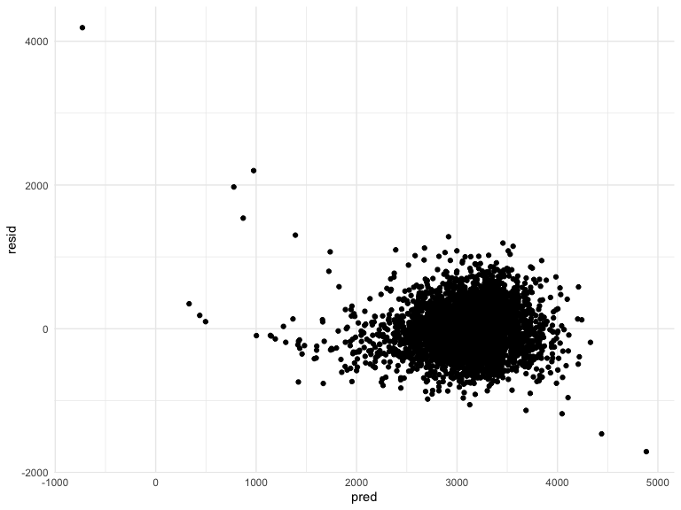
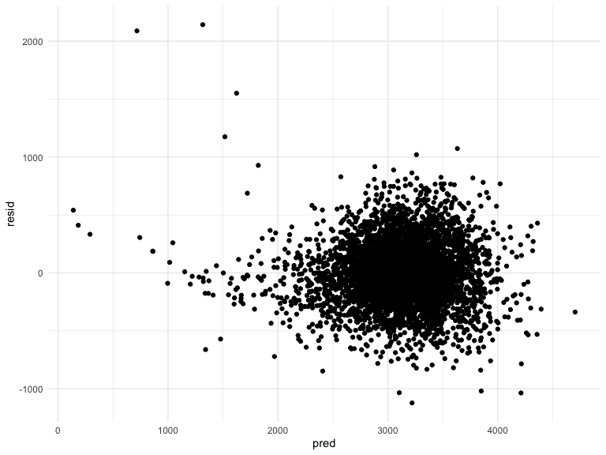
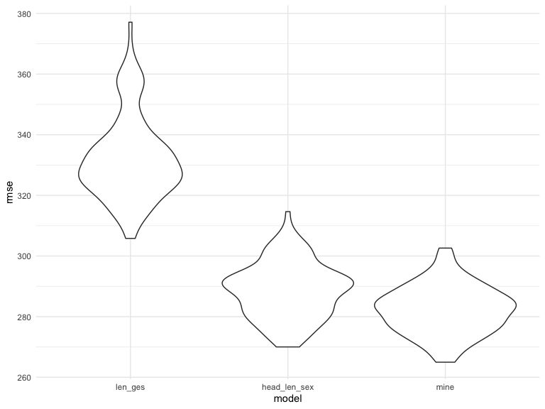
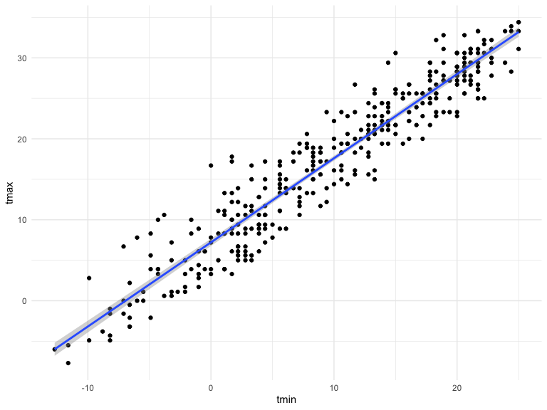
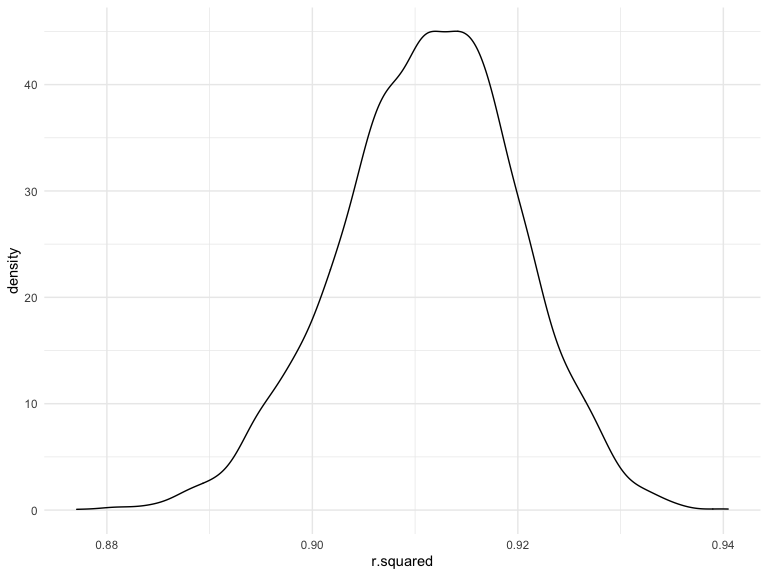

p8105\_hw6\_zh2494
================
zhuolun
11/29/2021

# Problem 1

read and clean the data  
\* The column names are tidy so no need to do anything  
\* Convert units: (pounds to grams, inches to centimeters)

``` r
baby_df = 
  read_csv("data/birthweight.csv") %>% 
  mutate(
    babysex = factor(babysex),
    frace = factor(frace),
    malform = factor(malform),
    mrace = factor(mrace),
    mheight = mheight * 2.54,
    delwt = delwt * 453.592,
    ppwt = ppwt * 453.592,
    wtgain = wtgain * 453.592)
```

-   checks the number of na, there is 0 missing value.

``` r
sum(is.na(baby_df))
```

    ## [1] 0

Create models

``` r
model_len_ges = lm(bwt ~ blength + gaweeks, data = baby_df)
model_len_ges %>% 
  broom::tidy() %>% 
  knitr::kable(digits = 3)
```

| term        |  estimate | std.error | statistic | p.value |
|:------------|----------:|----------:|----------:|--------:|
| (Intercept) | -4347.667 |    97.958 |   -44.383 |       0 |
| blength     |   128.556 |     1.990 |    64.604 |       0 |
| gaweeks     |    27.047 |     1.718 |    15.744 |       0 |

``` r
model_head_len_sex = lm(bwt ~ bhead * blength * babysex, data = baby_df)
model_head_len_sex %>% 
  broom::tidy() %>% 
  knitr::kable(digits = 3)
```

| term                   |  estimate | std.error | statistic | p.value |
|:-----------------------|----------:|----------:|----------:|--------:|
| (Intercept)            | -7176.817 |  1264.840 |    -5.674 |   0.000 |
| bhead                  |   181.796 |    38.054 |     4.777 |   0.000 |
| blength                |   102.127 |    26.212 |     3.896 |   0.000 |
| babysex2               |  6374.868 |  1677.767 |     3.800 |   0.000 |
| bhead:blength          |    -0.554 |     0.780 |    -0.710 |   0.478 |
| bhead:babysex2         |  -198.393 |    51.092 |    -3.883 |   0.000 |
| blength:babysex2       |  -123.773 |    35.119 |    -3.524 |   0.000 |
| bhead:blength:babysex2 |     3.878 |     1.057 |     3.670 |   0.000 |

The p-value = 0 because it is smaller than the minimum display value.
Also notice that `bhead:blength` is not significant.

the plot of model residuals against fitted values for the first model:
length at birth and gestational age as predictors

``` r
baby_df %>% 
  modelr::add_residuals(model_len_ges) %>% 
  modelr::add_predictions(model_len_ges) %>% 
  ggplot(aes(x = pred, y = resid)) + 
  geom_point()
```


comment: there are some wired values, but overall is good

a plot of model residuals against fitted values for the second model:
head circumference, length at birth, sex, and all interactions
(including the three-way interaction).

``` r
baby_df %>% 
  modelr::add_residuals(model_head_len_sex) %>% 
  modelr::add_predictions(model_head_len_sex) %>% 
  ggplot(aes(x = pred, y = resid)) + 
  geom_point()
```


comment: there are some wired values, but overall is good

Both required models are good. Now consider my own models.

``` r
mymodel =
  lm(bwt ~ (bhead + blength + delwt + mheight + pnumlbw + ppbmi + ppwt + smoken + wtgain)^2, data = baby_df)

baby_df %>% 
  modelr::add_residuals(mymodel) %>% 
  modelr::add_predictions(mymodel) %>% 
  ggplot(aes(x = pred, y = resid)) +
  geom_point()
```


comment: some extreme points exist but overall is good, use stepwise
regression to get a proper model.

using step wise regression to get a proper models

``` r
mod_select = step(mymodel, direction = 'backward')
```

choose the proper model provided by the step wise method

``` r
mymodel2 = lm(bwt ~ bhead + blength + delwt + mheight + ppbmi + ppwt + smoken + 
    wtgain + bhead:mheight + bhead:ppbmi + bhead:smoken + blength:delwt + 
    blength:mheight + blength:ppbmi + blength:smoken + delwt:ppbmi + 
    delwt:wtgain + mheight:ppbmi + mheight:ppwt + ppwt:wtgain, data = baby_df)
baby_df %>% 
  modelr::add_residuals(mymodel2) %>% 
  modelr::add_predictions(mymodel2) %>% 
  ggplot(aes(x = pred, y = resid)) +
  geom_point()
```



comment: the new residual plot is almost the same as the previous one.  
make a comparison three models in terms of the cross-validated
prediction error. use dataset `cv_mod` to do cv process, save models and
their `rmse`.

``` r
mod_df = 
  baby_df %>% 
  select(bwt, blength, gaweeks, bhead, babysex, delwt, mheight, pnumlbw, ppbmi, ppwt, smoken, wtgain)

cv_mod = 
  crossv_mc(mod_df, 100) %>% 
  mutate(
    train = map(train, as_tibble),
    test = map(test, as_tibble))

cv_mod = 
  cv_mod %>% 
  mutate(
    mod_len_ges  = map(train, ~lm(bwt ~ blength + gaweeks, data = .x)),
    mod_head_len_sex = map(train, ~lm(bwt ~ bhead * blength * babysex, data = .x)),
    mod_mine = map(train, ~lm(bwt ~ bhead + blength + delwt + mheight + ppbmi + ppwt + smoken + 
    wtgain + bhead:mheight + bhead:ppbmi + bhead:smoken + blength:delwt + 
    blength:mheight + blength:ppbmi + blength:smoken + delwt:ppbmi + 
    delwt:wtgain + mheight:ppbmi + mheight:ppwt + ppwt:wtgain, data = .x))) %>% 
  mutate(
    rmse_len_ges = map2_dbl(mod_len_ges, test, ~rmse(model = .x, data = .y)),
    rmse_head_len_sex = map2_dbl(mod_head_len_sex, test, ~rmse(model = .x, data = .y)),
    rmse_mine = map2_dbl(mod_mine, test, ~rmse(model = .x, data = .y)))
```

Plot the prediction error distribution for each model.

``` r
cv_mod %>% 
  select(starts_with("rmse")) %>% 
  pivot_longer(
    everything(),
    names_to = "model", 
    values_to = "rmse",
    names_prefix = "rmse_") %>% 
  mutate(model = fct_inorder(model)) %>% 
  ggplot(aes(x = model, y = rmse)) + 
  geom_violin()
```



the head\_len\_sex and mine models are better than len\_ges model. mine
model is little bit better than head\_len\_sex model, though there is a
little overlap between them.

# problem 2

``` r
weather_df = 
  rnoaa::meteo_pull_monitors(
    c("USW00094728"),
    var = c("PRCP", "TMIN", "TMAX"), 
    date_min = "2017-01-01",
    date_max = "2017-12-31") %>%
  mutate(
    name = recode(id, USW00094728 = "CentralPark_NY"),
    tmin = tmin / 10,
    tmax = tmax / 10) %>%
  select(name, id, everything())
```

    ## Registered S3 method overwritten by 'hoardr':
    ##   method           from
    ##   print.cache_info httr

    ## using cached file: ~/Library/Caches/R/noaa_ghcnd/USW00094728.dly

    ## date created (size, mb): 2021-10-05 10:29:42 (7.602)

    ## file min/max dates: 1869-01-01 / 2021-10-31

Do a simple linear regression with `tmax` as the response and `tmin` as
the predictor.  
use `bootstrap` to generate 5000 samples;  
fit the linear regression;  
extract `r.squared` and `log_b1b2` value of each sample

``` r
simple_df = 
  weather_df %>%
  select(tmax, tmin)
```

``` r
simple_df %>% 
  ggplot(aes(x = tmin, y = tmax)) +
  geom_point() +
  stat_smooth(method = "lm")
```

    ## `geom_smooth()` using formula 'y ~ x'



``` r
bootstrap_df =
  simple_df %>% 
  modelr::bootstrap(n = 5000) %>% 
  mutate(
    models = map(.x = strap, ~lm(tmax ~ tmin, data = .x)),
    result1 = map(models, broom::glance),
    result2 = map(models, broom::tidy)
  ) %>% 
  select(-strap, -models) %>% 
  unnest(result1, result2) %>% 
  select(.id, term, estimate, r.squared) %>% 
  group_by(.id) %>% 
  mutate(
    log_b1b2 = log10(prod(estimate))
  ) %>% 
  ungroup
```

confidence interval for 2.5% and 97.5% quantiles to provide a 95% CI.

``` r
bootstrap_df %>% 
  group_by(term) %>% 
  summarize(
    rsqr_ci_lower = quantile(r.squared, 0.025),
    rsqr_ci_higher = quantile(r.squared, 0.975),
    log_ci_lower = quantile(log_b1b2, 0.025),
    log_ci_higher = quantile(log_b1b2, 0.975),
  )
```

    ## # A tibble: 2 × 5
    ##   term        rsqr_ci_lower rsqr_ci_higher log_ci_lower log_ci_higher
    ##   <chr>               <dbl>          <dbl>        <dbl>         <dbl>
    ## 1 (Intercept)         0.894          0.927        0.854         0.894
    ## 2 tmin                0.894          0.927        0.854         0.894

plot the distribution of estimate for `r.squared`.

``` r
bootstrap_df %>% 
  filter(term == "tmin") %>% 
  ggplot(aes(x = r.squared)) + 
  geom_density()
```


comment: the distribution of `r.squared` looks like normal, but it
skewed a little bit to the left. Besides, the shape is a little thin.

plot the distribution of estimate for `log_b1b2`.

``` r
bootstrap_df %>% 
  filter(term == "tmin") %>% 
  ggplot(aes(x = log_b1b2)) + 
  geom_density()
```


comment: the distribution of `log_b1b2` looks like normal, but it skewed
a little bit to the left. The shape is a little thin as well.
